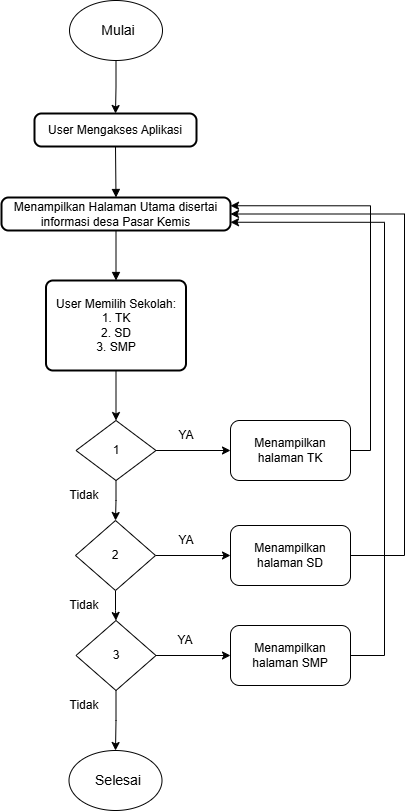

# pemmob_uts
# BRD STUDI KASUS Mobile Apps Sistem Informasi Geografis Desa

Nama: Sri Gustinah Fauziah

NIM: 20220801012

Tema: Mobile Apps Sistem Informasi Geografis Desa

**1.	Business Requirement Definition**

**Produk:**

a.	Layanan: Sistem Informasi Mengenai Desa Pasar Kemis serta Fasilitas Pendidikan atau Sekolah Yang Ada di Desa Pasar Kemis

b.	Definisi: Sistem informasi geografis desa Pasar Kemis adalah aplikasi berbasis mobile yang menyediakan informasi desa serta fasilitas pendidikan yang ada di desa Pasar Kemis. Sistem ini bertujuan untuk mempermudah masyarakat dalam mengakses informasi terkait fasilitas pendidikan di wilayah Pasar Kemis seperti TK, SD, dan SMP. Tidak termasuk SMA dikarenakan desa Pasar Kemis tidak ada SMA sehingga dalam sistem atau aplikasi mobile tidak akan menampilkan informasi SMA.

c.	Abstrak: Desa Pasar Kemis membutuhkan teknologi yang dapat memudahkan akses informasi mengenai fasilitas pendidikan. Sistem informasi geografis ini dibuat untuk memberikan kemudahan akses informasi secara cepat bagi masyarakat desa Pasar Kemis. Dengan adanya sistem ini, masyarakat dapat mengetahui sekolah di area terdekat dan membantu orang tua dalam menentukan sekolah untuk anak-anaknya.

**2. Penjelasan Fungsi**

**Fungsi Teknis:**

a.	Menyediakan detail desa Pasar Kemis seperti alamat kantor desa, kepala desa, serta kontak yang dapat dihubungi

b.	Menyediakan detail sekolah seperti nama, alamat, kurikulum, kontak yang dapat dihubungi, serta foto dari sekolah.

**Fungsi Strategis:**

a.	Meningkatkan transparansi dan kemudahan akses terhadap informasi fasilitas Pendidikan di Desa Pasar Kemis

b.	Membantu masyarakat khususnya orang tua untuk menemukan sekolah yang sesuai dengan kebutuhan anak mereka

c.	Meminimalisirkan waktu bagi masyarakat dalam pencarian informasi sekolah

**3. Fungsional dan Spesifikasi Kebutuhan**

3.1 Spesifikasi Kebutuhan

Aplikasi sistem informasi geografis desa Pasar Kemis dibuat untuk mempermudah masyarakat dalam mengakses informasi mengenai desa Pasar kemis dan fasilitas publik, yaitu informasi sekolah. Aplikasi ini bertujuan untuk memberikan kemudahan masyarakat dalam menemukan sekolah-sekolah yang ada di desa Pasar Kemis, baik untuk kepentingan pendidikan ataupun kebutuhan informasi umum. Dalam aplikasi ini, pengguna dapat menemukan detail informasi mengenai setiap sekolah yang tersedia, seperti nama sekolah, jenjang pendidikan seperti TK, SD, hingga SMP (tidak termasuk dengan SMA dikarenakan di desa Pasar Kemis belum ada SMA), alamat lengkap, kurikulum, serta nomor kontak yang dapat dihubungi. Aplikasi ini didesain agar dapat diakses dengan mudah melalui perangkat mobile, sehingga memudahkan warga untuk mendapatkan informasi kapan saja dan di mana saja. Sistem antarmuka aplikasi dikembangkan secara sederhana, sehingga pengguna dapat menggunakannya tanpa memerlukan pelatihan khusus atau pengalaman teknis. Dengan desain user-friendly ini, aplikasi dapat menjangkau pengguna dari berbagai usia dan latar belakang, termasuk mereka yang mungkin tidak terbiasa dengan teknologi.

3.2 Fungsional dan Proses

**Fungsional:**

a.	Detail Desa: menyediakan informasi desa Pasar Kemis ketika pengguna masuk ke dalam aplikasi seperti alamat kantor desa, kepala desa, serta kontak yang dapat dihubungi.

b.	Detail Sekolah: Menyediakan informasi detail dari setiap sekolah ketika pengguna mengklik sebuah button, termasuk nama, alamat, kurikulum, kontak yang dapat dihubungi, serta foto dari sekolah.

**Proses:**

a.	Pengguna membuka aplikasi dan dapat langsung mendapatkan informasi mengenai desa Pasar Kemis

b.	Pengguna dapat memillih sekolah yang ingin dilihat melalui button yang tersedia 

**4.	Usability and Performance Requirements**

**4.1 Kebutuhan Usability (Kemudahan Pengguna)**

a. Antarmuka harus sederhana atau user-friendly agar mudah diakses oleh pengguna dari berbagai kalangan tanpa pelatihan khusus.

b. Bahasa yang digunakan dalam menyampaikan informasi harus jelas dan tidak rancu.

c. Fungsi button pada aplikasi harus sesuai dengan fungsinya.

**4.2 Kebutuhan Performance (Kinerja)**

Sistem harus dapat berjalan lancar tanpa lag atau gangguan pada perangkat mobile

**4.3 Maintainability and Support Requirements**

Pemantauan teknis secara berkala untuk sewaktu-waktu ada pembaruan informasi

**5.	Security and Legal Requirements**

Sistem harus mematuhi regulasi pemerintah mengenai keamanan dan privasi data publik

**6.	Portability Requirements**

Aplikasi harus dapat diakses oleh perangkat mobile

